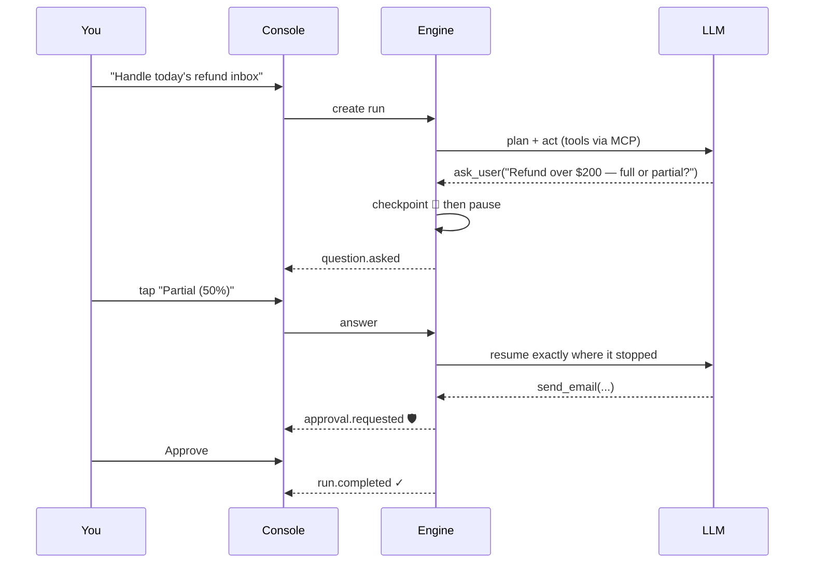

<div align="center">

# ✦ AgentKit

**Build AI agents in plain language. Run them reliably. They ask instead of guessing.**

[](https://soumyabratanandi.github.io/AgentKit/)
[](#)
[-334155?style=for-the-badge)](LICENSE)

<br/>

**[▶ Open the AgentKit Console](https://soumyabratanandi.github.io/AgentKit/)**

</div>

---

## Table of contents

1. [What is AgentKit?](#what-is-agentkit)
2. [The Console — a full tour](#the-console--a-full-tour)
3. [Getting started](#getting-started)
4. [Agent Specs explained](#agent-specs-explained)
5. [How a run works](#how-a-run-works)
6. [Run statuses](#run-statuses)
7. [Using the engine API directly](#using-the-engine-api-directly)
8. [Security & privacy](#security--privacy)
9. [Troubleshooting](#troubleshooting)
10. [FAQ](#faq)
11. [Roadmap](#roadmap)
12. [License](#license)

---

## What is AgentKit?

Most agent frameworks optimize for autonomy: the agent guesses, acts, and you find
out later. AgentKit optimizes for **trust**. Agents built with it behave like careful
colleagues:

| | Principle | What it means in practice |
|---|---|---|
| 💬 | **Ask, don't guess** | When a goal is ambiguous, the agent pauses and asks you a question — with tappable options — instead of fabricating a preference. |
| 🛡️ | **Humans gate side effects** | Sending, deleting, paying, posting: gated actions pause for your explicit approval. Enforced by the runtime, not by prompt hopes. A denial is information the agent adapts to. |
| 💾 | **Never breaks in the middle** | Every step is checkpointed. Kill the process mid-run, restart it tomorrow, answer the pending question — the run resumes exactly where it stopped, with no lost or repeated side effects. |
| 🔌 | **Any MCP server is a tool** | Gmail, filesystems, databases, your internal services — anything speaking the [Model Context Protocol](https://modelcontextprotocol.io) plugs in as agent tools, with per-tool permission filtering. |
| 🖥️ | **One engine, thin clients** | The CLI, this web console, and the SDKs are all thin frontends over one documented protocol (REST + JSON-RPC over WebSocket). |

AgentKit has two parts:

- **The engine** — runs on *your* machine (or your server). It talks to the LLM,
  launches MCP tool servers, checkpoints every step to a local SQLite database,
  and exposes a small HTTP API (default `http://localhost:4747`).
- **The Console** — the web app served from this repository. A thin client that
  visualizes and controls whatever engine URL you point it at.

## The Console — a full tour

### 📊 Dashboard (Mission control)

The home view. It shows:

- **Stat tiles** — total runs, currently running, *needs you*, completed, failed.
- **"Waiting on you" queue** — every run that has paused with a question or an
  approval, one click away from answering. This is the heart of the workflow:
  agents park themselves here instead of guessing.
- **Runs table** — every run with live status badges. Click any row for details.

### 🧾 Run detail (Event timeline)

Every run is an append-only stream of events, and this view renders it live:

| You'll see | Meaning |
|---|---|
| `plan.created` | The agent's explicit plan before it acts |
| `assistant.message` | What the agent is thinking/saying |
| `tool.call` / `tool.result` | Exactly which tool ran, with which arguments, and what came back |
| `question.asked` | The agent paused to ask you something |
| `approval.requested` | A gated action wants to run — nothing happens until you decide |
| `run.completed` / `run.failed` | Terminal result or error |

When a run pauses:

- **Questions** appear as an amber card — tap an option chip or type a free-form
  answer, and the run resumes instantly from exactly where it stopped.
- **Approvals** appear as a violet card showing the *precise* tool and arguments
  about to execute. **Approve & continue** runs it; **Deny** (with an optional
  reason) tells the agent to adapt — it never retries a denied action.

You can also **cancel** any non-finished run from the side panel.

### 🚀 New run

Two ways to launch an agent:

1. **Describe with AI** — type what you want in plain English
   (*"Reads support emails, checks our refund policy, drafts replies — but never
   sends without my approval"*). The builder generates a complete, validated
   Agent Spec. You always review it before anything runs.
2. **Spec editor** — paste or write the YAML spec yourself, hit **Validate**,
   set a goal, and **Launch**. You land directly on the live timeline.

### ⚙️ Settings

Set the engine URL the console talks to. The status pill in the top bar shows
live connectivity (`engine online` / `engine offline`, re-checked every 5 s).

## Getting started

1. **Run an AgentKit engine** on your machine:

   ```
   agentkit serve
   # AgentKit server listening on http://localhost:4747
   ```

   The engine needs an LLM: set `ANTHROPIC_API_KEY` for Claude (default), or run
   a local model with [Ollama](https://ollama.com) and set
   `AGENTKIT_PROVIDER=ollama` for a fully local setup.

2. **Open the Console:** **https://soumyabratanandi.github.io/AgentKit/**

3. The console connects to `http://localhost:4747` automatically. Using a remote
   or non-default engine? Change the URL under **Settings**.

That's it — create your first agent under **New run → Describe with AI**.

## Agent Specs explained

An agent is a small declarative YAML file — the contract between *plain language
in* and *reliable execution out*. The builder writes these for you, but they're
designed to be read and edited by hand:

```yaml
name: refund-email-assistant
description: Reads support emails, checks refund policy, drafts replies

model:
  provider: anthropic          # anthropic (default) | ollama
  model: claude-sonnet-5

planning: true                 # explicit plan step before acting (default)

tools:
  - mcp: "@modelcontextprotocol/server-gmail"
    permissions: [read, draft] # send/delete tools are never even exposed
  - mcp: "./policy-docs-server"

clarify:
  on_ambiguity: ask_user       # the core promise: never guess
  confidence_threshold: 0.7    # below this confidence, the agent MUST ask
  max_questions: 5

approvals:
  - action: send_email         # glob-matched against tool names
    requires: human            # pauses the run until you decide

checkpoints: enabled           # durable resume (default)
limits:
  max_turns: 50
  max_tool_calls: 200
```

### Field reference

| Field | What it does |
|---|---|
| `name` | Agent identifier (kebab-case). |
| `model` | LLM provider + model. Defaults to Anthropic `claude-sonnet-5`. |
| `instructions` | Extra system guidance (constraints, domain knowledge). |
| `planning` | If `true` (default), the agent states a numbered plan before acting — you see it in the timeline. |
| `tools[].mcp` | An MCP server: an npm package (launched via `npx`), a local path, or a remote URL. |
| `tools[].permissions` | Coarse verb filter — a tool is exposed only if its name contains a verb (`draft` matches `create_draft`) or it's annotated read-only and you allowed `read`. |
| `tools[].allow_tools` / `deny_tools` | Explicit glob allow/deny lists (deny always wins). |
| `clarify.on_ambiguity` | `ask_user` (pause and ask — default) · `best_guess` (proceed, but state every assumption) · `fail` (refuse to guess at all). |
| `approvals[]` | Actions requiring human sign-off. Globs match short (`send_email`) and qualified (`gmail__send_email`) tool names; the last matching rule wins, so you can gate `*` and un-gate `read_*`. |
| `checkpoints` | `enabled` (default) persists full state after every step; required for crash-safe resume. |
| `limits` | Hard turn / tool-call budgets so no run can spin forever. |

## How a run works



Between every step the engine writes a durable checkpoint containing the full
conversation **and any half-finished batch of tool calls**. The pause points
above survive process kills, machine restarts, and days of waiting — answering
a Tuesday question on Friday just works.

## Run statuses

| Status | Meaning | What to do |
|---|---|---|
| `running` | The agent is thinking or executing tools | Watch the timeline |
| `needs answer` | Paused on a clarification question | Answer it (chips or free text) |
| `needs approval` | Paused on a gated action | Approve or deny |
| `completed` | Finished — result shown in the timeline | Read the output |
| `failed` | Hit an error or a hard limit | Check the error, adjust, relaunch |
| `cancelled` | You cancelled it | — |

## Using the engine API directly

The Console is just one client. Anything can drive the same engine over REST:

| Endpoint | Purpose |
|---|---|
| `POST /v1/runs` `{spec, goal}` | Start a run (spec = YAML string or JSON) |
| `GET /v1/runs` · `GET /v1/runs/:id` | List / inspect runs |
| `GET /v1/runs/:id/events?sinceSeq=N` | Read the event stream incrementally |
| `POST /v1/runs/:id/answer` | Answer the pending question |
| `POST /v1/runs/:id/approve` | Approve / deny the pending action |
| `POST /v1/runs/:id/cancel` | Cancel a run |
| `POST /v1/spec/validate` | Validate a spec without running it |
| `POST /v1/spec/build` | Plain-language description → validated spec |

A WebSocket endpoint at `/v1/ws` (JSON-RPC 2.0) offers the same operations plus
live `run.event` push notifications. SDKs for JavaScript/TypeScript and Python
wrap this API; clients for other languages can be generated from the engine's
OpenAPI description.

## Security & privacy

- **Everything stays on your machine.** The Console is a static page; it holds
  no backend and collects nothing. All state — runs, checkpoints, prompts,
  outputs — lives in the engine's local SQLite database.
- **Credentials never leave home.** LLM API keys and MCP server credentials are
  environment variables on the machine running the engine. The Console never
  sees them.
- **Approvals are enforced by the runtime.** A gated tool call cannot execute
  without an explicit approval recorded in the event log — the model cannot
  talk its way past the gate.
- **Full audit trail.** Every event (every tool call, every answer, every
  approval) is persisted with a sequence number and timestamp.

## Troubleshooting

| Symptom | Fix |
|---|---|
| Top bar shows **engine offline** | Start the engine (`agentkit serve`) and confirm the URL under Settings matches (default `http://localhost:4747`). |
| Console can't reach a remote engine over plain `http://` | Browsers block mixed content for non-localhost hosts. Use `https://` for remote engines (a reverse proxy works), or access the console from the same host. |
| Run fails immediately with a provider error | Set `ANTHROPIC_API_KEY` (or configure Ollama) in the environment where the engine runs — not in the console. |
| An MCP tool server won't start | The engine launches npm-package servers via `npx` — check the engine's console output for the server's own error message. |
| Run seems stuck in `running` | Open the run: the timeline shows the last event. Long tool calls and LLM turns are normal; you can always **Cancel**. |

## FAQ

**Where is the source code?**
AgentKit's engine source is not published. This repository distributes the
**compiled Console** (in [`docs/`](docs/)) — the same model as most commercial
developer tools: you use the product; the implementation stays closed.

**How do I get the engine?**
The engine, CLI, and SDKs (JavaScript, Python) are distributed separately as
packages. npm/PyPI publication is planned; until then, contact the author for
access.

**Which models does it support?**
Anthropic Claude (default: `claude-sonnet-5`) and local models via Ollama, with
a pluggable provider interface.

**Can it run fully offline / air-gapped?**
Yes — run the engine with Ollama as the provider and local MCP servers, and
serve the console from your own network. Nothing in the runtime requires the
internet.

**What happens if the engine crashes mid-run?**
Nothing is lost. On restart, the run resumes from its last checkpoint — this
exact scenario (SIGKILL mid-pause, resume in a new process) is part of the
engine's test suite.

## Roadmap

- Streaming token deltas in the live timeline
- Multi-turn conversations per run
- Enterprise layer: policy engine, audit log surface, credential vault, SSO/RBAC
- Agent template gallery & MCP registry integration
- Generated .NET / Java / Rust clients from the OpenAPI spec

## License

The files distributed in this repository are covered by the [MIT License](LICENSE).
The AgentKit engine source code is proprietary and distributed separately.

---

<div align="center">
<sub>© 2026 Soumyabrata Nandi · <a href="https://soumyabratanandi.github.io/AgentKit/">Open the Console</a></sub>
</div>
