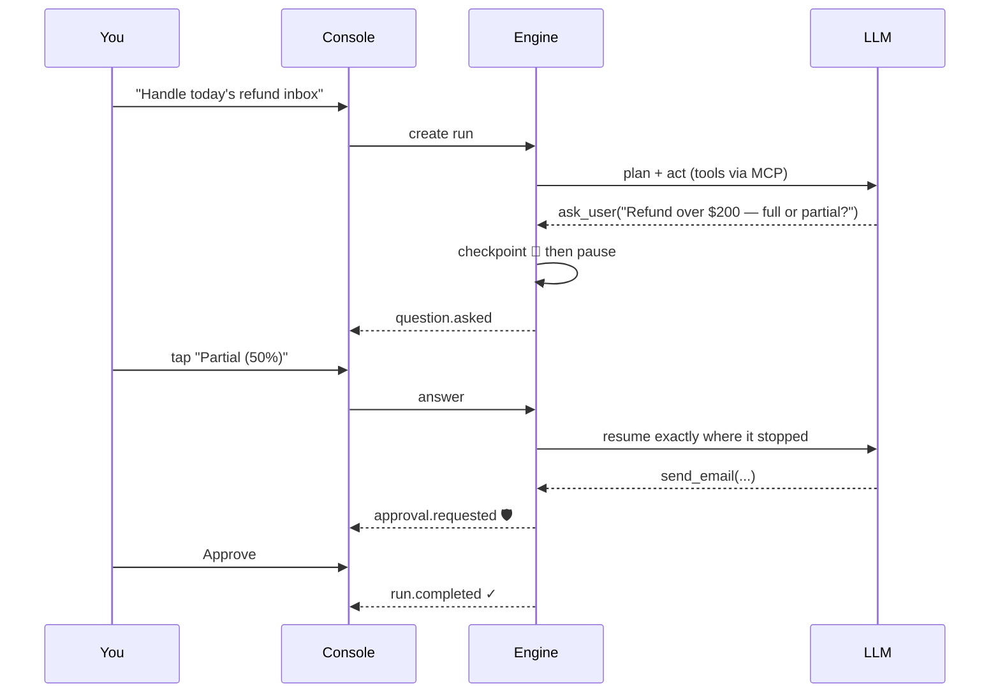

<div align="center">

# ✦ AgentKit

**Build AI agents in plain language. Run them reliably. They ask instead of guessing.**

[](https://soumyabratanandi.github.io/AgentKit/)
[](#)
[-334155?style=for-the-badge)](LICENSE)

<br/>

**[▶ Open the AgentKit Console](https://soumyabratanandi.github.io/AgentKit/)**

</div>

---

## Why AgentKit?

Most agent frameworks optimize for autonomy: the agent guesses, acts, and you find
out later. AgentKit optimizes for **trust**. Agents built with it behave like careful
colleagues:

| | Principle | What it means in practice |
|---|---|---|
| 💬 | **Ask, don't guess** | When a goal is ambiguous, the agent pauses and asks you a question — with tappable options — instead of fabricating a preference. |
| 🛡️ | **Humans gate side effects** | Sending, deleting, paying, posting: gated actions pause for your explicit approval. Enforced by the runtime, not by prompt hopes. A denial is information the agent adapts to. |
| 💾 | **Never breaks in the middle** | Every step is checkpointed. Kill the process mid-run, restart it tomorrow, answer the pending question — the run resumes exactly where it stopped, with no lost or repeated side effects. |
| 🔌 | **Any MCP server is a tool** | Gmail, filesystems, databases, your internal services — anything speaking the Model Context Protocol plugs in as agent tools, with per-tool permission filtering. |
| 🖥️ | **One engine, thin clients** | The CLI, this web console, and the SDKs are all thin frontends over one documented protocol (REST + JSON-RPC over WebSocket). |

## The Console

The [AgentKit Console](https://soumyabratanandi.github.io/AgentKit/) is mission
control for your agents:

- **Dashboard** — every run at a glance, with a live *"Waiting on you"* queue for
  agents that paused to ask something.
- **Event timeline** — watch each run think, plan, call tools, and pause, event by
  event, in real time.
- **Answer & approve inline** — clarification questions render as tappable options;
  gated actions show exactly which tool and arguments want to run before you decide.
- **Agent builder** — describe the agent you want in plain English; the builder
  writes a validated Agent Spec you can review, edit, and launch.

### Getting started

1. **Start your AgentKit engine** on your machine:
   ```
   agentkit serve        # REST + WebSocket on http://localhost:4747
   ```
2. **Open the console:** https://soumyabratanandi.github.io/AgentKit/
3. The console auto-connects to `http://localhost:4747` — change the engine URL
   anytime under **Settings**.

> 🔒 **Your data stays yours.** The console is a static app served from GitHub
> Pages. Runs, checkpoints, prompts, and credentials live only on the machine
> running your engine; the console talks exclusively to the engine URL you set.

## What an agent looks like

An agent is a small declarative spec — the contract between *plain language in*
and *reliable execution out*:

```yaml
name: refund-email-assistant
description: Reads support emails, checks refund policy, drafts replies
tools:
  - mcp: "@modelcontextprotocol/server-gmail"
    permissions: [read, draft]     # send/delete tools are never even exposed
  - mcp: "./policy-docs-server"
clarify:
  on_ambiguity: ask_user           # the core promise: never guess
  confidence_threshold: 0.7
approvals:
  - action: send_email
    requires: human                # pauses the run until you decide
checkpoints: enabled
```

## How a run flows



Between every step the engine writes a durable checkpoint — the pause points
above survive process kills, restarts, and days of waiting.

## FAQ

**Where is the source code?**
AgentKit's engine source is not published. This repository distributes the
**compiled Console** (in [`docs/`](docs/)) — the same model as most commercial
developer tools: you use the product; the implementation stays closed.

**How do I get the engine?**
The engine, CLI, and SDKs (JavaScript, Python) are distributed separately as
packages. npm/PyPI publication is planned; until then, contact the author for
access.

**Which models does it support?**
Anthropic Claude (default: `claude-sonnet-5`) and local models via Ollama, with
a pluggable provider interface.

**Does the console work offline?**
The console needs to reach your engine URL. The engine itself runs fully on your
machine and can use a local model via Ollama for a completely local setup.

## Roadmap

- Streaming token deltas in the live timeline
- Multi-turn conversations per run
- Enterprise layer: policy engine, audit log surface, credential vault, SSO/RBAC
- Agent template gallery & MCP registry integration

## License

The files distributed in this repository are covered by the [MIT License](LICENSE).
The AgentKit engine source code is proprietary and distributed separately.

---

<div align="center">
<sub>© 2026 Soumyabrata Nandi · Built with the AgentKit engine · <a href="https://soumyabratanandi.github.io/AgentKit/">Open the Console</a></sub>
</div>
